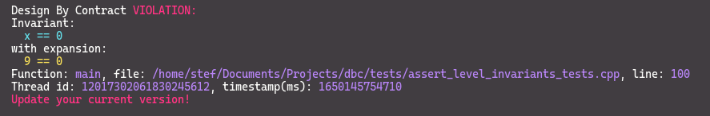

# A Design By Contract C++ framework


## Introduction

DBC is a simple, header-only, C++ library, that facilitates support for a defensive variation of the
Design By Contract framework, by making use of public assertion macros.

* DBC is **flexible**. Depending on the build option, (DBC_ASSERT_LEVEL_NONE, 
DBC_ASSERT_LEVEL_PRECONDITIONS, DBC_ASSERT_LEVEL_POSTCONDITIONS, DBC_ASSERT_LEVEL_INVARIANTS), 
client code can choose what types of contracts to evaluate. In addition, the error handling 
mechanism can be configured at runtime.

* DBC is **debug friendly**. It's assertions are overloaded, in order to provide
human friendly error messages. In addition, in case of a contract violation,
user friendly debug info, (including the file, function and much more) is
forwarded, plus it features boolean expression decomposition, in order to automatically output the
operands of a false boolean expression.

* DBC is **efficient**. It utilizes mostly std::string_view objects and primitive 
types for error reporting, while its assertions can be completely turned off. The DBC style 
assertions are used for their semantic value, thus no runtime overhead is suffered.

## Example Output 

Given the following DBC assertion:

`DBC_INVARIANT(x == 0, "What");`

If the condition `x == 0` is evaluated as false, the following can be output:



## Usage at a glance

Using DBC can be as simple as copying the dbc.hpp header to your project.
This example illustrates how the public dbc assertions can be used. It 
configures the dbc environment to emulate the assertion mechanism, by aborting
on debug builds and doing nothing on release builds.

~~~~~~~~~~cpp

#ifndef NDEBUG
#define DBC_ASSERT_LEVEL_INVARIANTS
#else
#define DBC_ASSERT_LEVEL_NONE
#endif

#include "dbc/dbc.hpp"
#include <string>

static auto flag{4};

extern auto running() -> bool;
extern void bar();

void foo(int x, int y)
{
    DBC_REQUIRE(x >= 0);
    DBC_REQUIRE(y == 0);

    flag = x + y;

    while (running())
    {
        DBC_INVARIANT(running());

        bar();

        DBC_INVARIANT(running());
    }

    DBC_ENSURE(flag >= 0);
}

int main() {
    dbc::set_violation_handler(dbc::abort_handler);
}

~~~~~~~~~~

More [examples](https://github.com/SoultatosStefanos/dbc/tree/master/examples) 
are available.


## Making the DBC assertions Prettier

The DBC assertion macros utilize the 'DBC_' prefix in order to avoid naming conflicts with other 
projects. That doesn't mean you're stuck with it, though. If you would like to use different 
identifiers (require, ensure, invariant, perhaps), you can simply do: 

~~~~~~~~~~cpp

#define require     DBC_REQUIRE
#define ensure      DBC_ENSURE
#define invariant   DBC_INVARIANT

~~~~~~~~~~

> **_NOTE:_**  Do <strong>NOT</strong> use #define require(args) DBC_REQUIRE(args)

### Copyright and Licensing

```

MIT License

Copyright (c) 2021 SoultatosStefanos

Permission is hereby granted, free of charge, to any person obtaining a copy
of this software and associated documentation files (the "Software"), to deal
in the Software without restriction, including without limitation the rights
to use, copy, modify, merge, publish, distribute, sublicense, and/or sell
copies of the Software, and to permit persons to whom the Software is
furnished to do so, subject to the following conditions:

The above copyright notice and this permission notice shall be included in all
copies or substantial portions of the Software.

THE SOFTWARE IS PROVIDED "AS IS", WITHOUT WARRANTY OF ANY KIND, EXPRESS OR
IMPLIED, INCLUDING BUT NOT LIMITED TO THE WARRANTIES OF MERCHANTABILITY,
FITNESS FOR A PARTICULAR PURPOSE AND NONINFRINGEMENT. IN NO EVENT SHALL THE
AUTHORS OR COPYRIGHT HOLDERS BE LIABLE FOR ANY CLAIM, DAMAGES OR OTHER
LIABILITY, WHETHER IN AN ACTION OF CONTRACT, TORT OR OTHERWISE, ARISING FROM,
OUT OF OR IN CONNECTION WITH THE SOFTWARE OR THE USE OR OTHER DEALINGS IN THE
SOFTWARE.

```

## Contributors

Soultatos Stefanos
